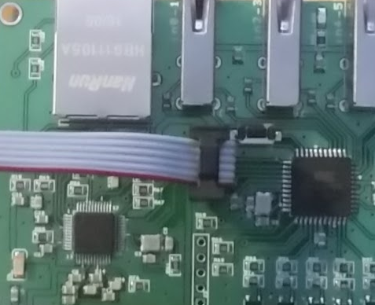

####AVR Ethernet PLC board

Buy:
https://www.tindie.com/products/8460/

This is a Tinovi AVR Ethernet board third-party hardware usaga sample code for IDE like eclipse based on Arduino libraries.
Use this or similar tutorial to add this project to Eclipse CDT IDE [Arduino Eclipse](http://playground.arduino.cc/Code/Eclipse)

Library is compatible with Arduino Etherent library:
https://github.com/arduino/Arduino/tree/master/libraries/Ethernet
but it has more powerful Wiznet ethernet chip W5500.

To programm board you should add AVR ISP compatable programmer to eclipse avrdude config properties. Plug in programmer wire as shown in picture:

Please consult [Forums](https://tinovi.com/forum/) for more information!

[Schematic](schematic.pdf)

Tinovi ethernet board is has total 8 analog/digital inputs accessible vai 4 connectors 2 inputs each and 5 relay outputs. It is based on ATMEGA644PA-AU MCU and WIZnet W5500 ethernet chip.
Inputs has USB-A type connector male socket each having access to 2 ATMEGA644PA-AU analog IO pins (PA0-PA7) and +5V power and ground. USB A-Type connector is very flexible. It allows to directly plug in PCB board with sensor adapter on it. Also can be used for custom outputs.

